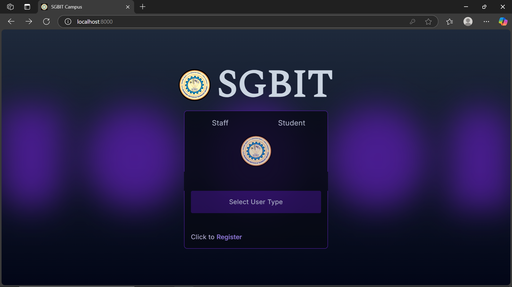
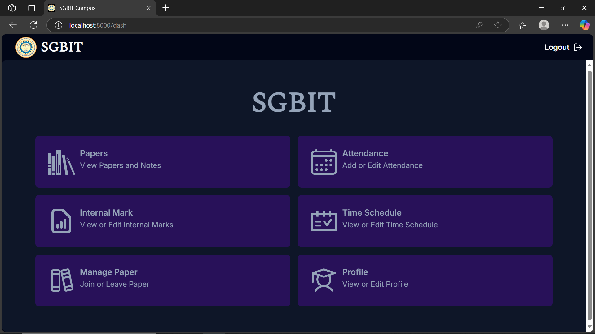
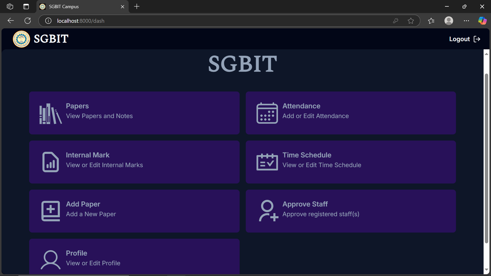
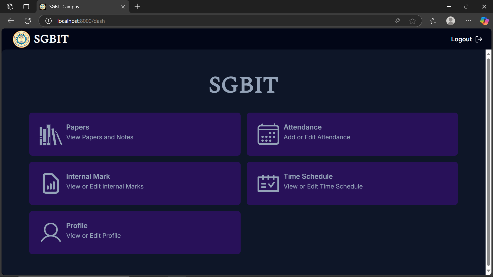

# ERP Portal for SGBIT 🎓

[](https://private-user-images.githubusercontent.com/169745851/399106914-189c0a63-fbe9-477d-ad4c-e59680fb0f4a.mp4?jwt=eyJhbGciOiJIUzI1NiIsInR5cCI6IkpXVCJ9.eyJpc3MiOiJnaXRodWIuY29tIiwiYXVkIjoicmF3LmdpdGh1YnVzZXJjb250ZW50LmNvbSIsImtleSI6ImtleTUiLCJleHAiOjE3MzU0MTYwMjUsIm5iZiI6MTczNTQxNTcyNSwicGF0aCI6Ii8xNjk3NDU4NTEvMzk5MTA2OTE0LTE4OWMwYTYzLWZiZTktNDc3ZC1hZDRjLWU1OTY4MGZiMGY0YS5tcDQ_WC1BbXotQWxnb3JpdGhtPUFXUzQtSE1BQy1TSEEyNTYmWC1BbXotQ3JlZGVudGlhbD1BS0lBVkNPRFlMU0E1M1BRSzRaQSUyRjIwMjQxMjI4JTJGdXMtZWFzdC0xJTJGczMlMkZhd3M0X3JlcXVlc3QmWC1BbXotRGF0ZT0yMDI0MTIyOFQxOTU1MjVaJlgtQW16LUV4cGlyZXM9MzAwJlgtQW16LVNpZ25hdHVyZT01MzhhYzBhYTBlNTM0YTJmNGQ0ZDRjMzU0YWFhNjZjMzkzY2YyMjQ4MGU2ZjhhOGM0NzQyNGY5YmM2NTE3Yzc1JlgtQW16LVNpZ25lZEhlYWRlcnM9aG9zdCJ9.weICiI4b_Erqfzmw0ZQIwg9-7CiP53s1a9obwe92GHQ)


## Overview 📋

The **ERP Portal** is a comprehensive data management system tailored for academic institutions. Designed to enhance administrative efficiency and the student learning experience, the portal offers **role-based access** for Teachers, HODs, and Students. With features like attendance tracking, internal marks management, and time schedule handling, it serves as a centralized hub for academic workflows.

## Features ✨

### 1. Teacher Role:

- Add and manage:
  - **Notes**
  - **Attendance**
  - **Internal Marks**
  - **Time Schedules**
- New Features:
  - **Export internal marks to PDF format**
  - **Advanced student search functionality**
  - **Bulk edit capabilities for marks**

### 2. HOD Role:

- All functionalities available to Teachers
- Additional features:
  - Approve new Teachers
  - Add new Papers (Subjects)

### 3. Student Role:

- View:
  - **Notes**
  - **Attendance**
  - **Internal Marks**
  - **Time Schedules**
- Enroll or withdraw from Papers (Subjects)

## Technology Stack 🛠️

- **Frontend:** React.js, TailwindCSS
- **Backend:** Node.js, Express.js
- **Database:** MongoDB
- **Additional Tools:** PDF generation utilities, Data processing libraries

## Screenshots 📸

### Main Portal



### Student Dashboard



### HOD Dashboard



### Teacher Dashboard



## Setup Instructions 🚀

### Prerequisites

- Node.js (v14+)
- MongoDB (local or cloud instance)

### Steps

1. **Clone the Repository:**

   ```bash
   git clone https://github.com/your-username/ERP-Portal.git
   cd ERP-Portal
   ```

2. **Install Dependencies:**

   ```bash
   npm install
   ```

3. **Setup Environment Variables:**

   - Create a `.env` file in the server-side root directory

   Example `.env` File Content:

   ```plaintext
   DATABASE_URI=<your_mongodb_connection_string>
   ```

4. **Run the Application:**

   ```bash
   npm start
   ```

5. **Access the Application:**
   - Open your browser and navigate to http://localhost:8000

## Key Features Added 🆕

- **PDF Export System:**
  - Generate and download internal marks reports
    
- **Enhanced Search:**
  - Advanced student search with multiple parameters
  - Real-time search results
  - Filter-based view options
- **Bulk Operations:**
  - Mass update capabilities for student records
  - Batch processing of marks
  - Efficient data management tools

## Purpose 🏆

This project demonstrates:

- **Proficiency in full-stack web development**
- **Skills in frontend frameworks, backend APIs, and database integration**
- **The ability to build modular, scalable, and efficient systems for real-world use cases**
